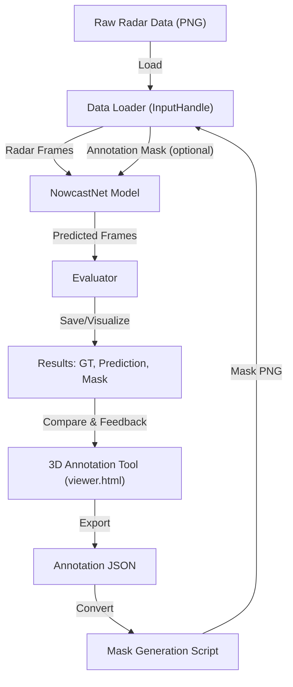

# Human-Physics-Hybrid-AI-System

Welcome! This project is my take on blending human intuition and physics-based AI for next-level nowcasting. Here, you'll find not just code, but a workflow that puts human expertise right into the heart of machine learning.

## 🚀 Overview
- This system leverages 3D point cloud technology to visualize and annotate radar data, enabling a richer, more intuitive interaction with complex meteorological phenomena.
- It combines interactive 3D annotation, automated mask generation, and a feedback-driven ML pipeline. The goal? To make AI that learns not just from data, but from you.

## ✨ Features
- **3D Point Cloud Visualization:** Explore and annotate radar data in a true 3D environment for deeper insight.
- **3D Annotation Tool:** Intuitive, browser-based, and fun to use.
- **Automated Mask Generation:** Turn your annotations into ML-ready masks in seconds.
- **Seamless ML Integration:** Feed human knowledge directly into NowcastNet.
- **Visual Feedback Loop:** Instantly compare model predictions with your own annotations.

## 🏗️ System Architecture

This diagram shows the actual workflow of the Human-Physics Hybrid AI System, as implemented in this repository:



**Workflow summary:**
- The 3D annotation tool lets you mark features of interest, exporting them as JSON.
- A script converts these annotations into mask images, which are optionally used by the data loader.
- The data loader feeds both radar frames and annotation masks to the NowcastNet model.
- The evaluator saves and visualizes predictions, ground truth, and annotation masks side-by-side.
- Results can be used to refine further annotations, closing the human-in-the-loop feedback loop.

## ⚡ Quick Start
1. **Clone this repo & install requirements**
2. **Launch the annotation tool:**
   ```bash
   xdg-open viewer.html
   ```
3. **Use the annotation tool:**
   - Open your data in the 3D viewer.
   - Annotate regions of interest (draw boxes, add descriptions).
   - Click 'Export' to save your annotations as a JSON file in the `annotations/` folder.
4. **Convert annotations to masks:**
   ```bash
   python3 convert_annotations_to_masks.py --json annotations/your_annotations.json --output_dir data/dataset/mrms/annotation_masks
   ```
5. **Run the ML pipeline:**
   ```bash
   cd code
   python3 run.py --worker 1 --device cpu:0 --cpu_worker 1 --dataset_name radar --dataset_path ../data/dataset/mrms/figure --pretrained_model ../data/checkpoints/mrms_model.ckpt --gen_frm_dir ../results/us/ --num_save_samples 10 --model_name NowcastNet --annotation_mask_path ../data/dataset/mrms/annotation_masks
   ```
6. **Visualize results:**
   Check the results folder for side-by-side comparisons of ground truth, predictions, and your annotation masks.

## 🖼️ Annotation Tool Demo


## 📊 Example Results


## 📄 Technical Report
For a deeper dive into my design decisions and the hybrid workflow, see [docs/technical_report.pdf](docs/technical_report.pdf)

## Large Files
Download these files separately due to GitHub's 100MB limit:
- [Model Checkpoint](your-link) (133 MB)
- [Point Cloud Data](your-link) (43 MB)

---

If you have questions, ideas, or want to collaborate, don't hesitate to reach out. I hope this project inspires you to blend human insight with AI in your own work!

---
MIT License 
